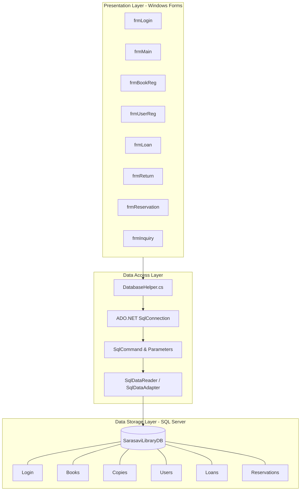
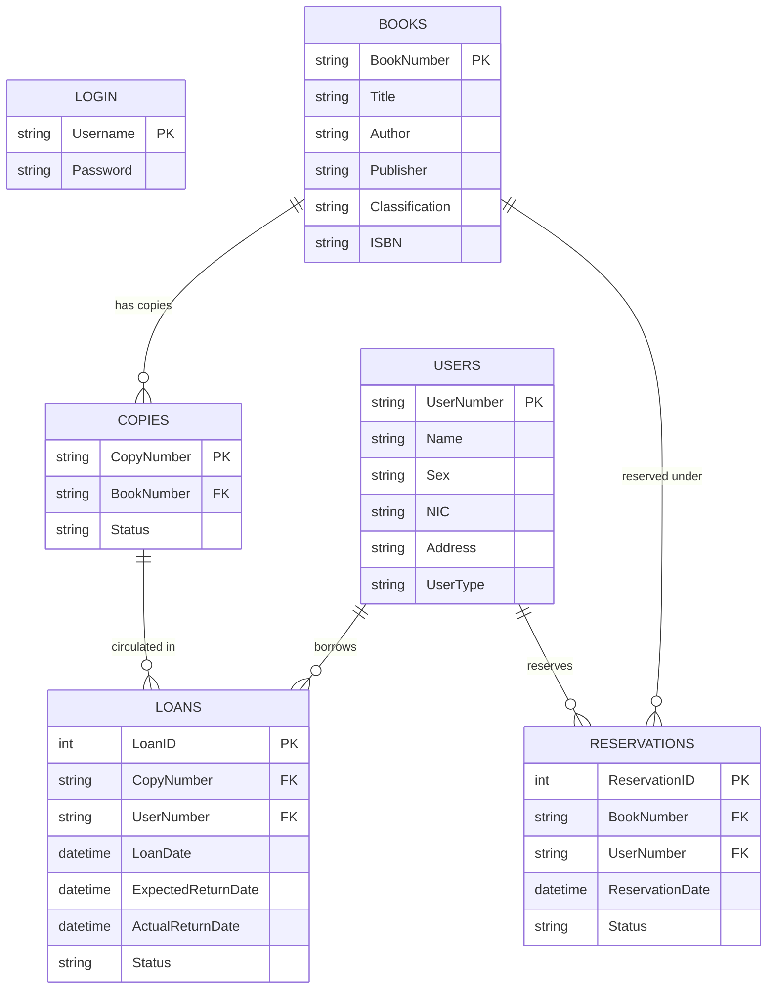

<div align="center">

# 📚 Sarasavi Library Management System

**A robust, enterprise-ready desktop Library Management System built with C#, Windows Forms, ADO.NET, and Microsoft SQL Server.**

[](https://microsoft.com/windows)
[](https://docs.microsoft.com/en-us/dotnet/csharp/)
[](https://dotnet.microsoft.com/)
[](https://www.microsoft.com/sql-server)
[](https://visualstudio.microsoft.com/)
[](LICENSE)

<p align="center">
  <a href="#-key-features">Key Features</a> •
  <a href="#-system-architecture">Architecture</a> •
  <a href="#-database-design--schema">Database Schema</a> •
  <a href="#-installation--setup">Setup Guide</a> •
  <a href="#-business-rules">Business Rules</a> •
  <a href="#-troubleshooting">Troubleshooting</a>
</p>

---

</div>

## 📌 Executive Summary

The **Sarasavi Library Management System** is an end-to-end desktop management solution developed for modern academic and institutional libraries. Designed using **C# (.NET Framework 4.7.2)** and a normalized **Microsoft SQL Server** relational backend, the system automates the core lifecycle of library operations:

- Member and visitor user onboarding
- Intelligent classification-based book cataloging & copy tracking
- Rule-enforced book lending and return circulation
- Real-time catalog availability inquiry and pending reservation alerts

By leveraging parameterized **ADO.NET** queries, the system ensures optimal performance, atomic data transactions, and strict immunity against SQL injection vulnerabilities.

---

## ✨ Key Features

```
                                  ┌───────────────┐
                                  │   frmLogin    │
                                  └───────┬───────┘
                                          │
                                          ▼
                                  ┌───────────────┐
                     ┌───────────►│    frmMain    │◄───────────┐
                     │            └───────┬───────┘            │
                     │                    │                    │
        ┌────────────┴───────────┐        │        ┌───────────┴────────────┐
        │ 📗 frmBookReg          │        │        │ 👤 frmUserReg          │
        │ • Auto-generate BookNo │        │        │ • Auto-generate UserNo │
        │ • Multi-copy status    │        │        │ • Scoped User Types    │
        └────────────────────────┘        │        └────────────────────────┘
                     ┌────────────────────┼────────────────────┐
                     ▼                    ▼                    ▼
        ┌────────────────────────┐┌───────────────┐┌────────────────────────┐
        │ 📤 frmLoan             ││ 📥 frmReturn  ││ 🔖 frmReservation      │
        │ • 5-book quota check   ││ • Auto Return ││ • Member verification  │
        │ • 14-day loan duration ││ • Alert Queue ││ • Duplicate prevention │
        └────────────────────────┘└───────────────┘└────────────────────────┘
                                          │
                                          ▼
                               ┌─────────────────────┐
                               │ 🔍 frmInquiry       │
                               │ • Multi-mode Search │
                               │ • Live Availability │
                               └─────────────────────┘
```

### 1. 🔐 Authentication & Session Control (`frmLogin`)
- Secure credential validation against backend database records.
- Prevents unauthorized access and protects navigation routes.

### 2. 🏠 Central Management Dashboard (`frmMain`)
- Clean, intuitive navigation hub providing single-click access to all operational forms.
- Safe session termination and confirmation dialogues upon logout.

### 3. 📗 Book Cataloging & Inventory Management (`frmBookReg`)
- **Automated Book IDs:** Dynamic generation of formatted identifiers based on classification prefixes (e.g., `CS0001`, `EE0002`).
- **Simultaneous Copy Creation:** Automatically binds physical copies (`Borrowable` vs. `Reference`) to master book records.
- Comprehensive metadata capture: Title, Author, Publisher, Classification, and ISBN.

### 4. 👤 Member & Visitor Directory (`frmUserReg`)
- **Sequential User IDs:** Auto-incrementing identifier scheme (`U0001`, `U0002`, ...).
- **Role Scoping:** Distinguishes between **Members** (eligible for full borrowing and reservations) and **Visitors** (in-library reading access only).
- Stores national identification (NIC), gender, contact address, and member type.

### 5. 📤 Loan Circulation Engine (`frmLoan`)
- **Validation Pipeline:**
  - Verifies member status (Visitors blocked from borrowing).
  - Enforces a strict quota of **maximum 5 active loans** per member.
  - Blocks non-circulating **Reference** copies.
  - Prevents double-loaning of currently issued copies.
- Automatically calculates and assigns a **14-day loan window**.

### 6. 📥 Return Processing & Reservation Notification (`frmReturn`)
- Single-step return processing via copy barcode / identification number.
- Updates loan records with exact timestamps and changes status to `Returned`.
- **Intelligent Reservation Queuing:** If a returned copy has a pending reservation, the system immediately displays a notification modal containing the reserving member's details and marks the reservation as fulfilled.

### 7. 🔖 Book Reservation Desk (`frmReservation`)
- Allows members to place reservations on in-demand catalog titles.
- Duplicate prevention: Blocks members from placing multiple pending reservations on the same title.
- Prioritizes reservations via first-come, first-served (FIFO) queue ordering.

### 8. 🔍 Multi-Criteria Catalog Search (`frmInquiry`)
- Real-time catalog filtering by **Book Number**, **Title**, or **Author**.
- Dynamically computes live copy status:
  - 🟢 **Available:** Ready for circulation.
  - 🟡 **On Loan:** Currently checked out by another borrower.
  - 🔵 **Reserved:** Held for a member reservation queue.

---

## 🏗️ System Architecture



---

## 🗄️ Database Design & Schema

### Entity Relationship Diagram (ERD)



### 📋 Complete Database Creation Script

Copy and execute the following SQL script in **SQL Server Management Studio (SSMS)** to initialize the complete database schema with primary keys, foreign key constraints, indexes, and initial seed data:

```sql
-- 1. Create Database
IF NOT EXISTS (SELECT name FROM sys.databases WHERE name = 'SarasaviLibraryDB')
BEGIN
    CREATE DATABASE SarasaviLibraryDB;
END
GO

USE SarasaviLibraryDB;
GO

-- 2. Create Login Table
IF OBJECT_ID('Login', 'U') IS NULL
BEGIN
    CREATE TABLE Login (
        Username NVARCHAR(50) PRIMARY KEY,
        Password NVARCHAR(100) NOT NULL
    );
END
GO

-- 3. Create Users Table
IF OBJECT_ID('Users', 'U') IS NULL
BEGIN
    CREATE TABLE Users (
        UserNumber VARCHAR(20) PRIMARY KEY,
        Name NVARCHAR(100) NOT NULL,
        Sex CHAR(1) NOT NULL CHECK (Sex IN ('M', 'F')),
        NIC VARCHAR(20) NOT NULL,
        Address NVARCHAR(255) NULL,
        UserType VARCHAR(20) NOT NULL CHECK (UserType IN ('Member', 'Visitor'))
    );
END
GO

-- 4. Create Books Table
IF OBJECT_ID('Books', 'U') IS NULL
BEGIN
    CREATE TABLE Books (
        BookNumber VARCHAR(20) PRIMARY KEY,
        Title NVARCHAR(200) NOT NULL,
        Author NVARCHAR(150) NOT NULL,
        Publisher NVARCHAR(150) NULL,
        Classification VARCHAR(20) NOT NULL,
        ISBN VARCHAR(50) NULL
    );
END
GO

-- 5. Create Copies Table
IF OBJECT_ID('Copies', 'U') IS NULL
BEGIN
    CREATE TABLE Copies (
        CopyNumber VARCHAR(30) PRIMARY KEY,
        BookNumber VARCHAR(20) NOT NULL,
        Status VARCHAR(20) NOT NULL CHECK (Status IN ('Borrowable', 'Reference')),
        CONSTRAINT FK_Copies_Books FOREIGN KEY (BookNumber) 
            REFERENCES Books(BookNumber) ON DELETE CASCADE
    );
END
GO

-- 6. Create Loans Table
IF OBJECT_ID('Loans', 'U') IS NULL
BEGIN
    CREATE TABLE Loans (
        LoanID INT IDENTITY(1,1) PRIMARY KEY,
        CopyNumber VARCHAR(30) NOT NULL,
        UserNumber VARCHAR(20) NOT NULL,
        LoanDate DATETIME NOT NULL,
        ExpectedReturnDate DATETIME NOT NULL,
        ActualReturnDate DATETIME NULL,
        Status VARCHAR(20) NOT NULL CHECK (Status IN ('Active', 'Returned')),
        CONSTRAINT FK_Loans_Copies FOREIGN KEY (CopyNumber) 
            REFERENCES Copies(CopyNumber),
        CONSTRAINT FK_Loans_Users FOREIGN KEY (UserNumber) 
            REFERENCES Users(UserNumber)
    );
END
GO

-- 7. Create Reservations Table
IF OBJECT_ID('Reservations', 'U') IS NULL
BEGIN
    CREATE TABLE Reservations (
        ReservationID INT IDENTITY(1,1) PRIMARY KEY,
        BookNumber VARCHAR(20) NOT NULL,
        UserNumber VARCHAR(20) NOT NULL,
        ReservationDate DATETIME NOT NULL,
        Status VARCHAR(20) NOT NULL CHECK (Status IN ('Pending', 'Completed')),
        CONSTRAINT FK_Reservations_Books FOREIGN KEY (BookNumber) 
            REFERENCES Books(BookNumber),
        CONSTRAINT FK_Reservations_Users FOREIGN KEY (UserNumber) 
            REFERENCES Users(UserNumber)
    );
END
GO

-- 8. Seed Initial Default Data
IF NOT EXISTS (SELECT 1 FROM Login WHERE Username = 'admin')
BEGIN
    INSERT INTO Login (Username, Password) VALUES ('admin', 'admin123');
END
GO

-- Sample Seed Data for Testing
IF NOT EXISTS (SELECT 1 FROM Users WHERE UserNumber = 'U0001')
BEGIN
    INSERT INTO Users (UserNumber, Name, Sex, NIC, Address, UserType) 
    VALUES ('U0001', 'Kamal Perera', 'M', '199512345678', 'No. 12, Galle Road, Colombo', 'Member'),
           ('U0002', 'Nimali Silva', 'F', '199856781234', 'No. 45, Kandy Road, Kiribathgoda', 'Visitor');
END
GO

IF NOT EXISTS (SELECT 1 FROM Books WHERE BookNumber = 'CS0001')
BEGIN
    INSERT INTO Books (BookNumber, Title, Author, Publisher, Classification, ISBN)
    VALUES ('CS0001', 'Introduction to Algorithms', 'Thomas H. Cormen', 'MIT Press', 'CS', '978-0262033848');

    INSERT INTO Copies (CopyNumber, BookNumber, Status)
    VALUES ('CS00011', 'CS0001', 'Borrowable');
END
GO
```

---

## 📁 Repository Structure

```
SarasaviLibrarySystem/
├── SarasaviLibrarySystem.slnx        # Visual Studio XML Solution File
├── SarasaviLibrarySystem.csproj      # C# Project File (.NET Framework 4.7.2)
├── App.config                        # Application XML Config
├── Program.cs                        # Program Entry Point (Launches frmLogin)
├── DatabaseHelper.cs                 # ADO.NET Connection Provider & Health Check
│
├── frmLogin.cs                       # Form: Staff Authentication
├── frmLogin.Designer.cs              # Form: Staff Authentication GUI layout
├── frmLogin.resx                     # Form: Resource definitions
│
├── frmMain.cs                        # Form: Main Dashboard Router
├── frmMain.Designer.cs               # Form: Main Dashboard GUI layout
│
├── frmBookReg.cs                     # Form: Book & Copy Inventory Entry
├── frmBookReg.Designer.cs            # Form: Book Registration GUI layout
│
├── frmUserReg.cs                     # Form: Member / Visitor Registration
├── frmUserReg.Designer.cs            # Form: User Registration GUI layout
│
├── frmLoan.cs                        # Form: Book Loan Issuance Engine
├── frmLoan.Designer.cs               # Form: Book Loan GUI layout
│
├── frmReturn.cs                      # Form: Book Return & Reservation Trigger
├── frmReturn.Designer.cs             # Form: Book Return GUI layout
│
├── frmReservation.cs                 # Form: Member Book Reservation
├── frmReservation.Designer.cs        # Form: Reservation GUI layout
│
├── frmInquiry.cs                     # Form: Multi-field Book Search & Grid
├── frmInquiry.Designer.cs            # Form: Book Inquiry GUI layout
│
├── Properties/
│   ├── AssemblyInfo.cs               # Binary versioning and metadata
│   ├── Resources.Designer.cs         # Strongly-typed resource class
│   └── Settings.Designer.cs          # Runtime settings provider
│
└── bin/Debug/
    └── SarasaviLibrarySystem.exe     # Compiled Win32 Executable
```

---

## 🚀 Installation & Setup

### Prerequisites
- **Operating System:** Windows 10 / 11 or Windows Server 2016+
- **Development Environment:** [Visual Studio 2022](https://visualstudio.microsoft.com/) (Community, Professional, or Enterprise) with the **.NET desktop development** workload installed.
- **Runtime:** .NET Framework 4.7.2 or higher.
- **Database Engine:** [Microsoft SQL Server Express](https://www.microsoft.com/en-us/sql-server/sql-server-downloads) (2016 or higher) and [SQL Server Management Studio (SSMS)](https://learn.microsoft.com/en-us/sql/ssms/download-sql-server-management-studio-ssms).

---

### Step-by-Step Installation

#### 1. Clone the Repository
```bash
git clone https://github.com/umindudinal/Library-Management-System-using-C-.git
cd Library-Management-System-using-C-
```

#### 2. Configure Database
1. Launch **SQL Server Management Studio (SSMS)** and connect to your SQL Server instance (e.g., `localhost\SQLEXPRESS` or `.\SQLEXPRESS`).
2. Open a **New Query** window.
3. Paste the contents of the [SQL Database Creation Script](#-complete-database-creation-script) and click **Execute (F5)**.

#### 3. Update the Database Connection String
Open `DatabaseHelper.cs` and configure the connection string to point to your local SQL Server instance:

```csharp
// Located in DatabaseHelper.cs
private static string connectionString = 
    "Server=YOUR-MACHINE-NAME\\SQLEXPRESS;Database=SarasaviLibraryDB;Integrated Security=True;";
```

> [!TIP]
> If you are using local default SQL Server instance, you can use:
> `"Server=.;Database=SarasaviLibraryDB;Integrated Security=True;"` or `"Server=(local);Database=SarasaviLibraryDB;Integrated Security=True;"`

#### 4. Build and Run the Application
1. Double-click `SarasaviLibrarySystem.slnx` to open the solution in **Visual Studio 2022**.
2. Select **Debug** or **Release** configuration with target platform **AnyCPU**.
3. Press **F5** (or click **Start**) to build and run the application.

---

## 🔑 Default Credentials

| Role | Username | Password |
|------|----------|----------|
| Administrator / Staff | `admin` | `admin123` |

---

## 📏 Business Rules & Constraints

| # | Domain | Constraint / Rule |
|---|--------|-------------------|
| 1 | **Borrowing Quota** | A Member is allowed a maximum of **5 active loans** concurrently. |
| 2 | **Visitor Restrictions** | Visitors cannot borrow books or place title reservations. |
| 3 | **Reference Material** | Physical copies marked as `Reference` cannot be checked out on loan. |
| 4 | **Standard Loan Period** | Loan duration is fixed at **14 days** from date of issuance. |
| 5 | **Reservation Alerts** | Returning a book with pending reservations triggers an immediate staff notification modal and flags the oldest reservation as completed. |
| 6 | **Unique Book Identification** | Book IDs are prefixed with uppercase classification codes (e.g., `CS0001`, `MATH0002`). |
| 7 | **Duplicate Reservation Block** | A Member cannot place multiple pending reservations on the same book title. |

---

## 🔧 Troubleshooting

<details>
<summary><b>1. SqlException: A network-related or instance-specific error occurred</b></summary>

- **Cause:** Visual Studio cannot reach the SQL Server instance specified in `DatabaseHelper.cs`.
- **Solution:**
  1. Open Windows **Services (`services.msc`)** and ensure `SQL Server (SQLEXPRESS)` is in the **Running** state.
  2. Verify that your machine/instance name in `DatabaseHelper.cs` matches your SSMS server connection string.
</details>

<details>
<summary><b>2. Target Framework Version Error</b></summary>

- **Cause:** Visual Studio missing the target .NET Framework 4.7.2 Developer Pack.
- **Solution:**
  1. Open Visual Studio Installer.
  2. Select **Modify** on your VS 2022 installation.
  3. Under Individual Components, search for **.NET Framework 4.7.2 targeting pack** and install it.
</details>

<details>
<summary><b>3. Login Failed for User</b></summary>

- **Cause:** Database table `Login` does not contain the target user or Windows Integrated Security is disabled.
- **Solution:**
  1. Execute the seed query in SSMS:
     ```sql
     INSERT INTO Login (Username, Password) VALUES ('admin', 'admin123');
     ```
  2. Ensure `Integrated Security=True;` is retained in `DatabaseHelper.cs` if using Windows Authentication.
</details>

---

## 👨‍💻 Author & Maintainer

**Umindu Dinal**
- **GitHub:** [@umindudinal](https://github.com/umindudinal)
- **Email:** [umindudinal@gmail.com](mailto:umindudinal@gmail.com)

---

## 📄 License

This project is licensed under the [MIT License](LICENSE) — feel free to use and adapt this project for educational and commercial purposes.

<div align="center">
  <sub>Built with ❤️ using C#, .NET Framework, and Microsoft SQL Server.</sub>
</div>
